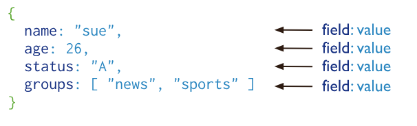

import { Card, Aside, Icon, Steps } from '@astrojs/starlight/components';

## 1) Introduction

Comme expliqué en 2DON1, les bases de données orientées document permettent de stocker les données sous la forme d'un document d'un format donné. Ce format est généralement soit du JSON soit de l'XML.

Nous vous proposons ici une introduction à MongoDB, un SGBD orienté document axé sur le JSON.



Le JSON est naturellement présent dans le code JavaScript des applications web, ce qui facilite (dans beaucoup de cas) l'implémentation de la persistance des données d'une telle application: il n'est plus nécessaire d'écrire du code pour faire correspondre les données JSON et la structure d'une base de données relationnelle normalisée.

Ceci est un cas particulier du problème plus général, évoqué en 2DON1 et présent en informatique depuis (au moins) les années 1990: la différence de paradigmes entre modèle relationnel (d'une part) et programmation orientée objet (d'autre part). Comment faire correspondre le plus rapidement possible les données des objets de notre application avec celles de la base de données ?

Dans le cas où les données de l'application sont encodées en JSON, un système comme MongoDB apporte une solution à ce problème.

## 2) MongoDB

La documentation officielle de MongoDb est disponible ici: https://www.mongodb.com/ 

**Attention**: MongoDB est disponible en plusieurs versions, dont une version cloud nommée 'Atlas'. Cette dernière est fort mise en avant dans la documentation, nous ne nous en préoccuperons pas et utiliserons simplement la version 'Community' (gratuite).

Nous vous propons à nouveau une installation via Docker. La commande à utiliser est similaire à celles utilisés pour Redis/Neo4j (nous utilisons cette fois le port 27017, standard pour la communication avec le serveur MongoDB):

``` bash showLineNumbers=false
docker run --name MyMongoDB -d -p 27017:27017 mongo
```

Comme auparavant, ayez à l'esprit les commandes de base de docker pour gérer le conteneur (`docker ps`, `docker logs`, `docker start`, `docker stop`).

Connectez-vous à la ligne de commande (shell) du serveur MongoDB:

``` bash showLineNumbers=false
docker exec -it MyMongoDB mongosh
```

### Gestion des bases de données sous MongoDB

MongoDB vous permet de créer plusieurs bases de données distinctes. Pour voir les bases de données disponibles, tapez:

``` bash showLineNumbers=false
show dbs
```

Vous voyez apparaître plusieurs bases de données crées automatiquement par MongoDB lors de l'installation (`admin`, `config`, `local`), nous n'y toucherons pas pour le moment.

La commande `use` permet de se connecter à une base de données existante. Si le nom fournit ne correspond pas à une base de donnée existante, elle est créée. Créez votre base de données en tapant:

``` bash showLineNumbers=false
use MyDB
```

Pour voir la base de données à laquelle vous êtes connecté, tapez simplement:

``` bash showLineNumbers=false
db
```

## 3) Documents et collections

MongoDB permet donc de stocker des **documents**, c'est-à-dire des données au format JSON. Ces documents sont rassemblés au sein d'une **collection** (et chaque collection appartient à une base de données, créées comme expliqué à la section précédente).

Par rapport à une base de donnée relationnelle standard, la documentation officielle MongoDB suggère l'analogie suivante:

- une collection (MongoDB) = une table (SGBD relationnel),
- un document JSON (MongoDB) = une ligne de données (SGBD relationnel).