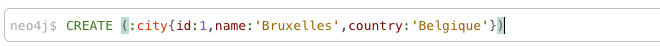
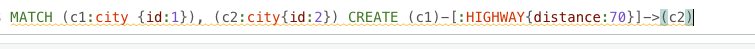

import { Card, Aside, Icon, Steps } from '@astrojs/starlight/components';

## 1) Introduction

Nous vous proposons ici une introduction aux système de base de données orientés graphes. Ceux-ci sont adaptés pour stocker/manipuler/exploiter des données modélisées sous forme de graphes.

L'image suivante représente un exemple de graphe comprenant trois sommets:


On remarque sur cette image que:

1. Les sommets peuvent représenter différents **concepts** (ici: des films, des personnes ou des acteurs).

2. Les liens entre les sommets possèdent une **orientation**. Autrement dit, les graphes sont dirigés.

3. Les relations possèdent un certain **type**, qui représentent la façon dont les concepts sont reliés  (ACTED_IN, DIRECTED).

4. Les liens et les sommets possèdent des attributs (le nom et la date de naissance dans le cas d'une personne).

Comme vous l'avez certainement compris, le graphe ci-dessus modélise des données cinématographiques (des films et des personnes liées à ces films).

Le modélisation sous forme de graphe ne se prête pas à toutes les applications, une réflexion doit être menée au préalable.

<Card title="Modéliser les données sous forme de graphe" icon="pencil">
Fournissez deux exemples supplémentaires d'application où les graphes apparaissent naturellement (aidez-vous d'internet au besoin). Dans chaque cas, précisez clairement ce que les sommets et les arcs représentent.
</Card>

## 2) Graphes et modèle relationnel

Contrairement à ce que l'on pourrait penser, il est parfaitement possible de représenter un graphe au sein du modèle relationnel (standard) de données. L'exercice suivant vous montre comment.

<Card title="Graphe et modèle relationnel" icon="pencil">
 Nous souhaiterions modéliser les données du réseau d'autoroute de l'Europe sous la forme d'un graphe:

- chaque sommet du graphe représente une ville. On souhaite stocker, le nom de la ville, le pays auquel elle appartient, ainsi qu'un numéro d'identification pour chaque ville.

- deux villes sont reliées par une arc s'il existe un tronçon d'autoroute reliant directement ces deux villes. Chaque tronçon possède une ville de départ et une ville d'arrivée. On souhaite stocker la longueur du tronçon (en kilomètres).

1. Fournissez un schéma relationnel modélisant le graphe ci-dessus (prenez simplement une relation pour les villes et une autre pour les tronçons).
**Soyez précis !** Nous vous demandons un schéma relationnel complet, comprenant les noms des relations, les différents attributs, les clés primaires et cles étrangères, les autres contraintes éventuelles.

2. Fournir une requête SQL permettant d'obtenir les villes qu'il est possible d'atteindre au départ de Bruxelles en utilisant un (seul) tronçon d'autoroute.

3. Que devient la requête SQL ci-dessus si on remplace un tronçon par deux tronçons ? Trois tronçons ? Un nombre quelconque de tronçons ?
</Card>

Comme vous avez pu le constater ci-dessus, les requêtes SQL nécessaires pour parcourir le graphe deviennent vite longue et fastidieuse. L'utilisation d'un SGBD dédié à la manipulation des graphes prend alors ici tout son intérêt.

## 3) Neo4j

Le système de base de données **Neo4j** est spécialement conçu pour représenter et exploiter des donnes sous forme de graphe. On communique avec celui-ci au moyen d'un langage particulier que nous allons apprendre à utiliser: **Cypher**.

La documentation officielle de Neo4j est disponible ici: https://neo4j.com/

Nous vous proposons à nouveau ici d'installer Neo4j via une image docker, mais n'hésitez pas à suivre les étapes d'installation spécifiques à votre système d'exploitation si vous le souhaitez.

La commande Docker à utiliser est (remplacez le mot de passe `myPassword` par un mot de passe de votre choix):

``` bash showLineNumbers=false
docker run --name MyNeo4j -p7474:7474 -p7687:7687 -d -e NEO4J_AUTH=neo4j/myPassword neo4j:5
```

Utilisez un autre nom de conteneur que MyNeo4j si vous le désirez. L'option:

``` bash showLineNumbers=false
-p7474:7474 -p7687:7687
```

permet d'exposer les ports 7474 (pour accéder à l'interface web d'administration de Neo4j via votre navigateur) et 7687 (pour l'envoi de commandes au serveur via le protocole Bolt, un protocole spécifique à Neo4j).

Pensez à vérifier que le conteneur est bien actif (`docker ps -a`) et allez consulter les logs en cas de problème éventuel (`docker logs MyNeo4j`). Utilisez les commandes docker habituelles pour lancer/stoper/supprimer le conteneur.

Vous devriez à présent avoir accès à l'interface web via:

http://localhost:7474/

Connectez vous (au moyen du user/mot de passe fournis ci-dessus) et vérifiez que tout est bien en place. Vous devriez obtenir sur le côté gauche des informations sur le nombre de sommets (noeuds) et d'arcs (relations) de votre base de donées, soit zéro pour le moment (votre base de données est vide):


## 4) Cypher

Nous allons à présent apprendre à ajouter des noeuds (sommets) et des relations (arcs) à notre graphe au moyen du langage Cypher. Pour ce faire, utilisez simplement la zone de texte située au dessus de l'interface web:


Reprenons notre graphe modélisant le réseau autoroutier européen. Pour créer un noeud dont le nom est Bruxelles et l'id est 1, utilisez la requête **CREATE** de la sorte:



Exécutez cette requête. Exécutez une requête similaire pour la création de la ville de Mons au sein du graphe.

Vous voyez alors les deux noeuds de votre graphe dans l'interface de Neo4j:


Pour ajouter un arc entre ces deux villes, la requête CREATE peut également être utilisée. Cependant, il faut d'abord demander à Neo4j d'aller chercher les noeuds en question (au moyen d'une requête MATCH) et de créez deux variables permettant de faire références aux noeuds en question dans le CREATE. 

La requête à utiliser pour ajouter une autoroute de longueur 70 de Bruxelles à Mons est donc la suivante (c1 et c2 sont les noms des variables mentionnées ci-dessus):



Remarquez le nom de la relation (HIGHWAY) et le sens de celle-ci (précisée par la flèche c1 -> c2). Les variables c1 et c2, définies par la requête MATCH, peuvent-être utilisées dans toute la suite (ici, le CREATE).
La relation apparaît alors dans l'interface de Neo4j:


<Card title="Cypher" icon="pencil">
Ajoutes les villes suivantes à votre graphe: Valenciennes (France), Lilles (France), Courtrai (Belgique), Gand (Belgique), Calais(France).
Ajoutez les tronçons d'autoroute suivants:

- Mons->Valencienne (45 km),

- Courtrai->Lille (35 km), 

- Gand->Courtrai (30 km),

- Gand->Calais (75 km).
</Card>
